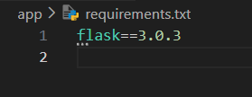
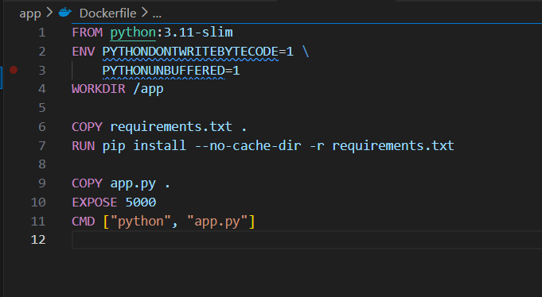
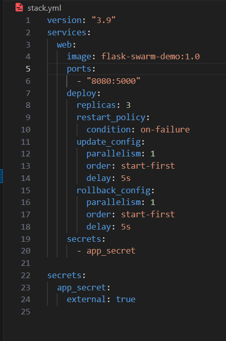
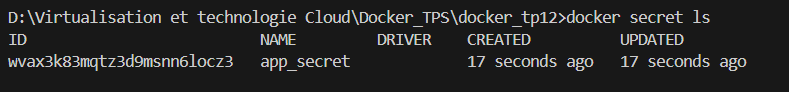
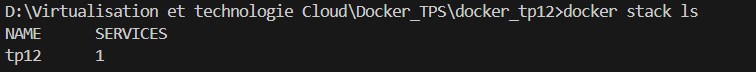
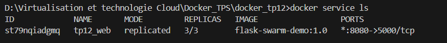
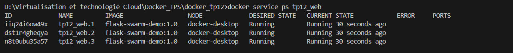
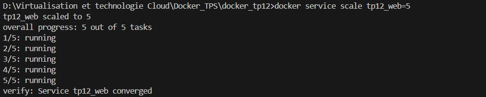
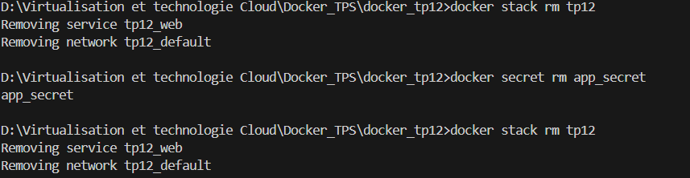

# TP — Docker Swarm : Déploiement d’une application Flask

Ce projet montre comment construire une image Docker, créer un secret Swarm, déployer une stack avec plusieurs réplicas et effectuer un scaling sur Docker Swarm (mode single-node).

---

## 📂 1. Arborescence du projet

docker_tp12/
├── app/
│ ├── app.py
│ ├── requirements.txt
│ └── Dockerfile
├── stack.yml
└── secret.txt

---

## 📄 2. Fichiers du projet

### **app/app.py**
Application Flask affichant le hostname du conteneur + un secret Swarm.


---

### **app/requirements.txt**



---

### **app/Dockerfile**

Dockerfile minimal pour exécuter l’application Flask.


---

### **secret.txt**

Contient le secret à injecter dans Docker Swarm.


---

### **stack.yml**

Stack Swarm + secrets + scaling + stratégie de mise à jour.


---

## 🏗️ 3. Construction de l’image

```bash
cd app
docker build -t flask-swarm-demo:1.0 .


4. Initialisation Docker Swarm

docker swarm init

5. Création du secret Swarm

docker secret create app_secret ../secret.txt


6. Déploiement de la stack

cd ..
docker stack deploy -c stack.yml tp12



🌍 7. Test dans le navigateur
Accéder à :


http://localhost:8080
Le hostname change à chaque rafraîchissement (3 réplicas).


8. Scaling (mise à l’échelle)

docker service scale tp12_web=5

9. Nettoyage

docker stack rm tp12
docker secret rm app_secret
docker swarm leave --force


10. Conclusion
Ce TP montre comment :

Construire une image Flask Docker

Créer et gérer des secrets Docker Swarm

Déployer une stack multi-réplicas

Réaliser du rolling update / rollback

Faire du scaling à chaud

Nettoyer correctement l’environnement Swarm

📦 Auteur
Projet réalisé par : Ayoub Faradi
Module : Cloud & Virtualisation
---